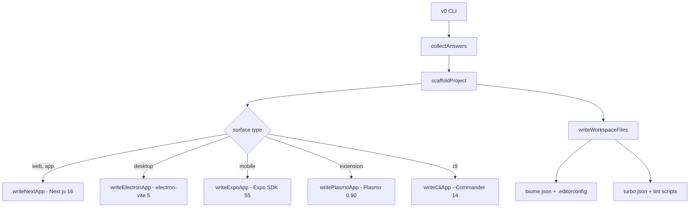

# 2026-04-24

## Session 1: Surface-specific scaffolding + linter setup

### System Flow

### What Was Done

- [x] Added `cli` to AppSurface type in types.ts
- [x] Created `writeElectronApp()` — electron-vite 5, React, PostCSS + @tailwindcss/postcss, Google Fonts
- [x] Created `writeExpoApp()` — Expo SDK 55, expo-router, NativeWind v5, monorepo metro config
- [x] Created `writePlasmoApp()` — Plasmo 0.90.5, Tailwind v3 (v4 incompatible), valid PNG icon
- [x] Created `writeCliApp()` — Commander.js 14, per-route subcommands
- [x] Updated `scaffoldProject()` routing — switch dispatch for all 6 surfaces
- [x] Fixed Bun hoisting issues — postinstall symlink for @shipshitdev/ui with `|| true`
- [x] Fixed Electron CSS — switched from @tailwindcss/vite to @tailwindcss/postcss (matching shipcode)
- [x] Fixed Electron fonts — replaced @fontsource imports with Google Fonts `<link>`
- [x] Fixed Expo versions — pinned to SDK 55 compatible versions (react 19.2.0, react-native 0.83.6)
- [x] Fixed Expo babel — added explicit `babel-preset-expo` dep (Bun hoisting)
- [x] Fixed Expo metro — monorepo watchFolders + nodeModulesPaths config
- [x] Fixed Plasmo icon — generated valid 128x128 white PNG (replaced corrupt base64)
- [x] Fixed Plasmo Tailwind — fell back to v3.4.19 (v4 broken per PlasmoHQ/plasmo#1188)
- [x] Fixed CLI exit code — show help without error when no subcommand
- [x] Fixed GitHub default — `--github-repo` flag flips default to Yes
- [x] Added `.editorconfig` to generated projects (matches shipcode)
- [x] Added `biome.json` to generated projects (Tailwind directives, import sorting, recommended rules)
- [x] Added `lint`, `lint:fix`, `format:check` scripts to generated root package.json
- [x] Added per-app `lint` scripts (web: app/, desktop: src/, mobile: app/, extension: ., cli: src/)
- [x] Added `lint`, `lint:fix`, `format:check` scripts to v0 codebase package.json
- [x] Landing page updates — colors aligned to shipcode design system, favicon, layout fixes
- [x] Version bump to 0.0.2
- [x] Removed Workspace stats box from sidebar
- [x] Replaced all raw `<button>` with `<Button>` from @shipshitdev/ui

### Key Decisions

| Decision | Rationale |
|----------|-----------|
| PostCSS over @tailwindcss/vite for Electron | @tailwindcss/vite doesn't process CSS correctly in electron-vite renderer. Shipcode uses PostCSS — proven pattern. |
| Tailwind v3 for Plasmo | Tailwind v4 uses jiti which requires node:module — Plasmo's Parcel bundler can't resolve it. Known bug PlasmoHQ/plasmo#1188. |
| Google Fonts over @fontsource for Electron | @fontsource gets hoisted by Bun into .bun/ — Vite can't resolve the import, killing the entire module chain. |
| postinstall symlink for @shipshitdev/ui | Bun hoists scoped packages to node_modules/.bun/ — Tailwind @source and app imports can't find them without a top-level symlink. |
| Expo SDK 55 (not latest packages) | Expo pins peer deps to specific versions. Using latest react/react-native causes warnings and potential breakage. |

### Files Changed

| File | Change |
|------|--------|
| `src/scaffold.ts` | +1784/-355 — all surface writers, biome.json, .editorconfig generation |
| `src/types.ts` | Added `cli` to AppSurface, DEFAULT_APPS |
| `src/skill-selection.ts` | Added `cli: []` to APP_AGENT_SKILLS |
| `src/runtime.ts` | Updated scriptDescription() for all surfaces |
| `src/prompts.ts` | GitHub default flips to Yes when --github-repo provided |
| `src/parse.ts` | Minor CLI parsing updates |
| `src/index.ts` | Progress label updates |
| `src/agent.ts` | Agent prompt updates |
| `package.json` | Added lint/lint:fix/format:check scripts, v0.0.2 |
| `site/index.html` | 6 app surfaces, updated copy |
| `site/styles.css` | Shipcode color palette, layout fixes |
| `site/assets/favicon.svg` | New — white v0 favicon |
| `README.md` | Updated |
| `tsconfig.json` | Minor updates |

### Mistakes and Fixes

| Mistake | Fix |
|---------|-----|
| Used invalid base64 for Plasmo icon PNG | Generated valid 128x128 PNG programmatically with zlib/CRC32 |
| Used @tailwindcss/vite for Electron | Switched to @tailwindcss/postcss — Vite plugin doesn't work in electron-vite renderer context |
| Used @fontsource imports in Electron renderer | Replaced with Google Fonts `<link>` in index.html — Bun hoisting breaks the import |
| Used latest react/react-native with Expo SDK 55 | Pinned to SDK 55 expected versions |
| Forgot `babel-preset-expo` as explicit dep | Added to mobile devDependencies — Bun hoists it away from Metro's resolution |
| postinstall script exited non-zero when @shipshitdev/ui not in deps | Added `|| true` at end |

### Next Steps

- [ ] QA all 6 surfaces in scaffolded project (user testing in progress)
- [ ] Verify Electron CSS renders correctly with PostCSS approach
- [ ] Test Expo mobile app loads in browser/simulator
- [ ] Deploy v0.0.2 to npm (user approval pending)
- [ ] Consider adding test scripts to generated projects
